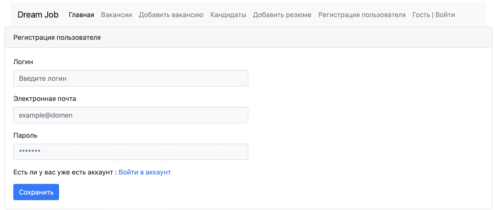
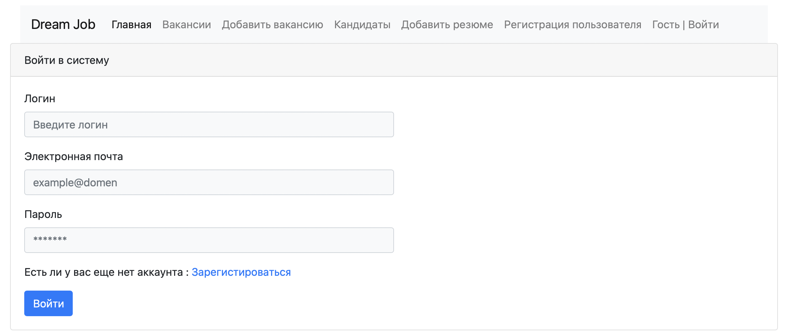
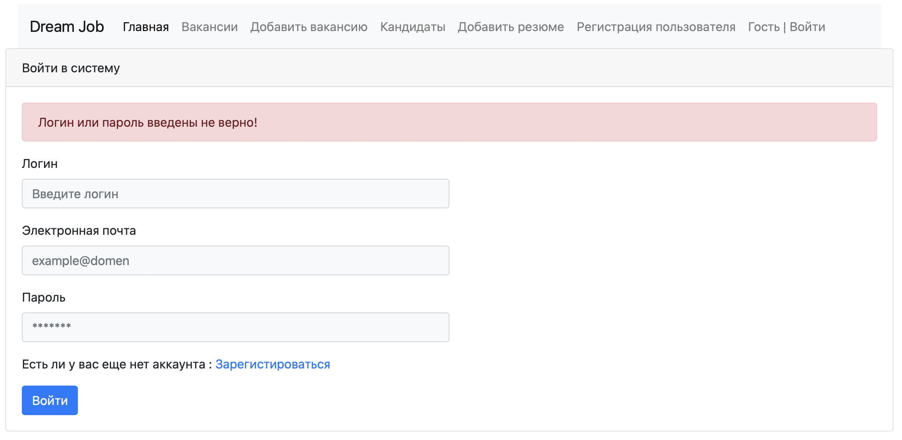
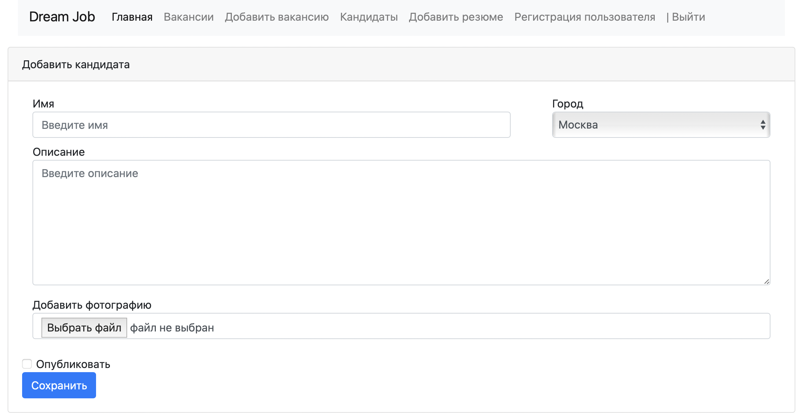
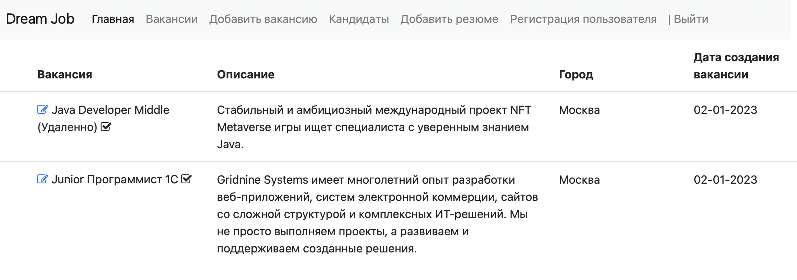
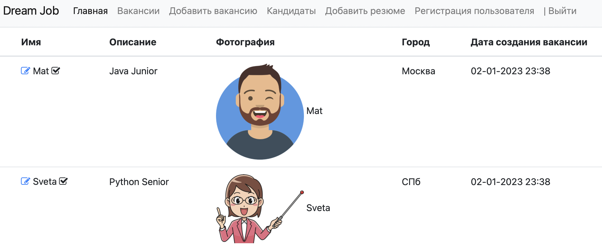

# Проект "Работа мечты"

## О проекте:

Web-приложение для размещения  вакансий и резюме.

## Стек технологий

- **Сборка приложения в Maven 3.8**
- **Java 18**
- **Spring Boot 2.7.3**
- **HTML 5**
- **Thymeleaf 2.7.3**
- **BOOTSTRAP 4.4.1**
- **Mockito 4.8.0**
- **H2**

## Требования к окружению

- **Java 18**
- **Maven 3.8**
- **PostgresSQL 14**

## Запуск проекта

- **Создать БД**
``` shell 
create database dreamjob;
```
- **Запустить проект по команде**
``` shell 
mvn spring-boot:run
```

## Взаимодействие с приложением

Главное окно приложения представляет собой хранилище для активных резюме и для поиска кадидатов. Выкладывать и просматривать активные вакансии может только зарегестрированный пользователь.

 Форма для регистрации: 



Форма для входа:



Если пользователь ввел не верные данные:



Чтобы добавить резюме необходимо нажать на "Добавить резюме" :



Чтобы добавить вакансию необходимо нажать на "Добавить вакансию" :


Список кандидатов и вакансий выглядит следующим образом:




## Контакты

- liana.timirgazina@yandex.ru
- <a href="https://t.me/mymomsaysimcool/" target="_blank">Телеграм</a></h1>
   